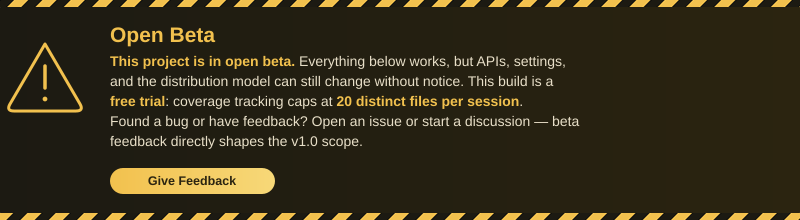
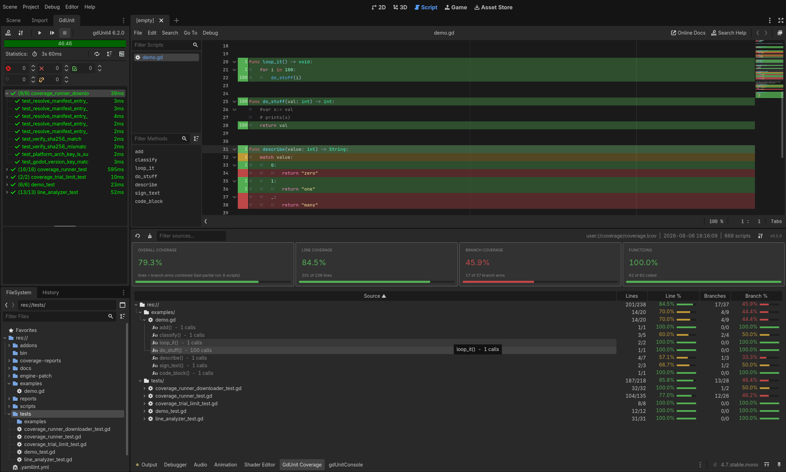

# GdUnit4 Coverage

  

## Code Coverage for GDScript

**GdUnit4 Coverage** tracks exactly what your
[gdUnit4](https://github.com/MikeSchulze/gdUnit4) tests execute in your
**GDScript** code. Use it to verify your tests actually exercise the logic
they claim to, before untested paths ship as bugs.

  

## Features

- Line, function, and branch coverage, with optional real execution counts
- Coverage gutter and line coloring right in the script editor
- Coverage report panel with a summary and per-file breakdown
- LCOV export for CI integration
- Filters to exclude tests and addon code from your coverage
- Partial runs merge cleanly into the existing report
- Fully configurable — thresholds, filters, and runner behavior all
  adjustable in project settings
- Recorded in-process by **gdcov**, a patched Godot engine build — no
  bytecode instrumentation, near-zero runtime overhead
- gdcov runner downloads automatically for your Godot version

## Trial Limits

This public build is a free trial: coverage tracking stops recording new
files once 20 distinct files have been tracked in a session. There's no
time limit and no license key. The unlimited version isn't distributed
yet during the closed beta.

## Requirements

- **Godot Engine:** 4.7 (stable) — the gdcov runner must match your
  project's Godot **minor** version exactly
- **gdUnit4:** v6.2 or later, installed in your project

## Documentation

- **[Installation & Setup](docs/INSTALLATION.md)** — Step-by-step guide
- **[Usage Guide](docs/USAGE.md)** — Running coverage, reading the gutter
  and report panel
- **[API Reference](docs/API.md)** — `CoverageApi` GDScript API
- **[Examples](docs/EXAMPLES.md)** — Common workflows, including CI/CD
- **[Troubleshooting](docs/TROUBLESHOOTING.md)** — Common issues &
  solutions
- **[Architecture](docs/ARCHITECTURE.md)** — How it works, editor vs.
  gdcov runner

## Support

  

  

- **Report Bugs:**
  [Issues](https://github.com/godot-gdunit-labs/gdUnit4-coverage/issues)
- **Ask Questions:**
  [Discussions](https://github.com/godot-gdunit-labs/gdUnit4-coverage/discussions)
- **Learn More:** See [docs/](docs/)

## License

Plugin code (`addons/gdunit4_coverage/`) is MIT-licensed — see
[LICENSE](LICENSE). The GDExtension and the gdcov engine patch are
closed-source and distributed as compiled binaries only.

The gdcov runner is a patched build of
[Godot Engine](https://godotengine.org/), © Godot Engine contributors,
MIT-licensed.

## Status

**Version:** 0.1.4 — Open Beta

---

Last Updated: 2026-08-06
