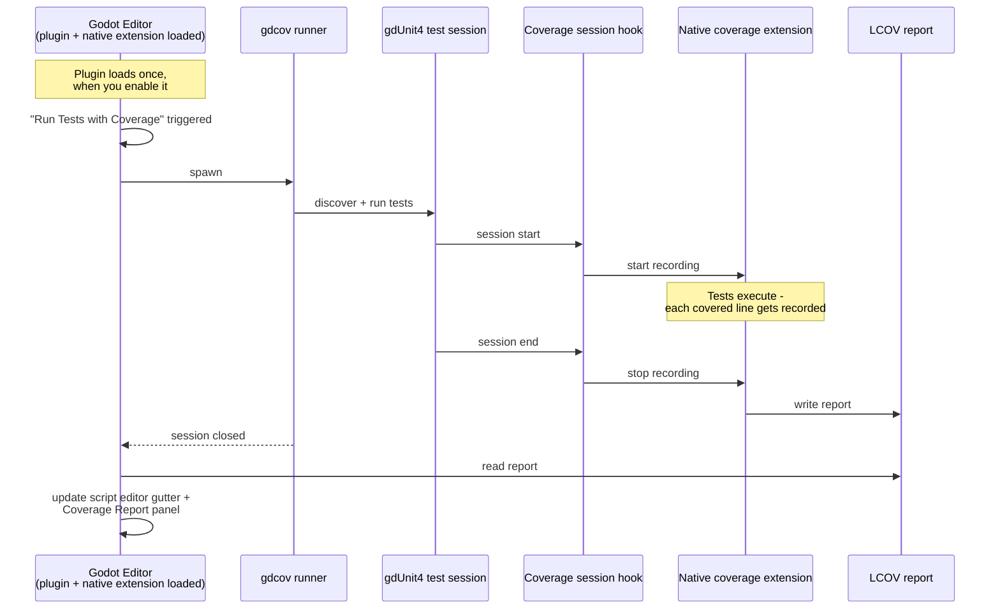

# Architecture

## How It Works

A coverage run involves two Godot processes: the **editor**, where the
plugin lives and results get displayed, and the **gdcov runner**, a
separate process the editor spawns to actually execute your tests.
gdcov is a purpose-built Godot build that can record which lines your
tests execute as they run — a stock Godot binary can't do this, which
is why the runner needs to be [set up
separately](INSTALLATION.md#step-4-set-up-the-gdcov-runner).

- **Editor** — where you enable the plugin, trigger a coverage run, and
  view results (gutter coloring, the Coverage Report panel).
- **gdcov runner** — spawned per run, executes your gdUnit4 test suite
  and records coverage as it goes.
- **Coverage session hook** —
  `addons/gdunit4_coverage/GdUnitCoverageTestSessionHook.gd`. gdUnit4
  calls it automatically at the start and end of every test session;
  it's what tells the extension when to start and stop recording.
  Registered automatically when you enable the plugin — nothing to
  configure.
- **Native coverage extension** — the GDExtension (`CoverageApi.gd`'s
  backing implementation) that talks to the runner, collects what it
  recorded, and writes the LCOV report.
- **LCOV report** — the single artifact that connects the two
  processes. The editor reads it back once the session closes to
  render the gutter and report panel.

See [Usage Guide](USAGE.md) for how to trigger a run, and
[Troubleshooting](TROUBLESHOOTING.md) if a run isn't producing data.
