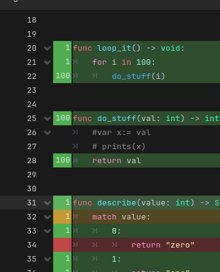
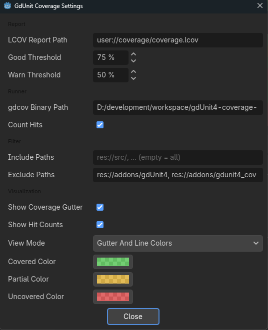

# Usage Guide

## Overview

Coverage runs are explicit — pick one of the "Run ... with Coverage"
commands rather than tests tracking coverage automatically every time.
This keeps normal (non-coverage) test runs at full speed, and lets you
scope a coverage run to exactly the tests you care about.

Before your first run, make sure the gdcov runner is set up
(**Project → Tools → GdUnit4 Coverage: Setup Coverage Runner**) — see
[Installation](INSTALLATION.md#step-4-set-up-the-gdcov-runner).

## Running Tests with Coverage

There are four entry points, all producing the same result:

- **Project → Tools → GdUnit4 Coverage: Run Tests with Coverage** — runs
  your full gdUnit4 test suite
- **gdUnit4 Inspector** → right-click a test/suite → **Run Inspector
  Tests with Coverage** — runs the selected tests
- **Script Editor** → right-click while editing a test file → **Run
  Tests with Coverage** — runs the current test file
- **FileSystem dock** → right-click a folder or test file → **Run Tests
  with Coverage** — runs everything under the selection

Each of these spawns the gdcov runner, streams results live to the
gdUnit4 Inspector over gdUnit4's own TCP server, and — when the session
closes — writes the LCOV report and updates the editor gutter.

A run started via the Inspector or context menus for a subset of tests
is a **partial run**: it merges into the existing LCOV report at file
granularity (scripts touched by this run replace their record;
everything else keeps its prior record). The full **Run Tests with
Coverage** command from the Tools menu is always an overall run.

## Viewing Coverage

### In the Editor Gutter

Open any tracked GDScript file — the gutter (left margin) shows hit
counts and colors per line:

<p align="center">
  
</p>

- **Green** — line executed by tests
- **Amber** — line partially covered (e.g. only some branch arms taken)
- **Red** — line not executed

Display style is configurable. Easiest: click the gear icon
("Coverage settings") in the **Coverage Report panel**'s toolbar to pop
up the settings dialog shown below — the same options also live under
**Project Settings → Gdunit4 Coverage → Visualization → View Mode** if
you'd rather edit them there. View Mode picks gutter only (default),
gutter + line color tint, or line tint only. Per-line hit counts can be
shown in the gutter too (`Show Hit Counts`), but real execution counts
require enabling `gdunit4_coverage/runner/count_hits` — by default only
covered/uncovered (0/1) is recorded.

The gutter is applied automatically when a session closes. Reopened a
script afterward and lost the coloring? **Project → Tools → GdUnit4
Coverage: Show Last Report** reloads the last LCOV report into the
currently open editor without rerunning tests.

<p align="center">
  
</p>

### Coverage Report Panel

Click the **GdUnit Coverage** tab in the bottom dock (next to the
GdUnit Console) to open the panel. It loads on its own — no command
needed: the last report at editor start, then a fresh one after every
coverage run.

- **Summary cards** — Overall coverage, Line coverage, Branch coverage,
  Functions called. Each shows a percentage, covered/total detail, and
  a progress bar.
- **Source tree** — directory → script → function, with columns for
  Lines, Line %, Branches, Branch %. Double-click a row to open that
  script or function in the editor.

Percentages are color-coded against configurable thresholds
(**Project Settings → Gdunit4 Coverage → Report → Threshold Good/Warn
Percent**).

## Exporting Coverage

The LCOV report is written automatically at the end of every coverage
session to **Project Settings → Gdunit4 Coverage → Export → Lcov Path**
(default `user://coverage/coverage.lcov`). LCOV includes line, function,
and branch records, and can be:

- Loaded by CI/CD tools (GitHub Actions, GitLab CI, etc.)
- Viewed with `genhtml` or other LCOV-compatible viewers
- Uploaded to services like Codecov or Coveralls

You can also export or merge programmatically:

```gdscript
# Overwrite the report entirely
CoverageApi.export_lcov("user://coverage/coverage.lcov")

# Merge this session's data into an existing report, file by file
CoverageApi.export_lcov_merged("user://coverage/coverage.lcov")
```

## Clearing Coverage Data

To reset tracking and start fresh:

```gdscript
CoverageApi.reset()
```

## Filtering What Gets Tracked

```gdscript
CoverageApi.set_include_filters(["res://src/"])
CoverageApi.set_exclude_filters(["res://tests/", "res://addons/"])
```

Or set the equivalent project settings
(`gdunit4_coverage/filter/include_paths` / `exclude_paths`, default
exclude is `res://addons/`). Untracked scripts get no per-line
tracking, so excluding also speeds up runs.

## API Reference

See [API.md](API.md) for the complete `CoverageApi` reference.

## Examples

See [EXAMPLES.md](EXAMPLES.md) for practical workflows, including CI/CD.

## Troubleshooting

See [TROUBLESHOOTING.md](TROUBLESHOOTING.md) for common issues.

## Performance

Coverage runs on the **gdcov** runner, which records line hits
in-process — no bytecode instrumentation, no debugger round trips. A
tracked line records at most once per run, so overhead scales with the
number of *tracked* lines, not with how often they execute, and stays
near-zero in practice. Enabling `count_hits` switches every line to
real per-line execution counts, instead of the default one-shot
covered/uncovered recording.

## Support

- 🐛 [Report Issues](https://github.com/godot-gdunit-labs/gdUnit4-coverage/issues)
- 💬 [Ask Questions](https://github.com/godot-gdunit-labs/gdUnit4-coverage/discussions)
